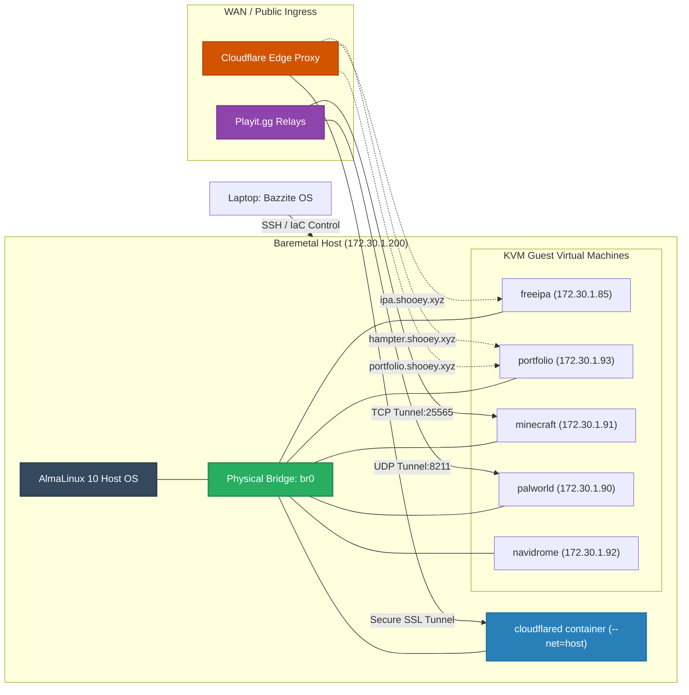

# Enterprise Hybrid IaC Homelab: Version 2 🚀

THis is my **Homelab Version 2**. This project is an advanced, expanded, and more secure iteration of the private cloud architecture first built in [Homelab v1](https://github.com/Isshi0417/homelab-server.git).

Version 2 upgrades the OS baseline, scales the virtual infrastructure from 3 to 5 virtual machines, shifts from experimental Podman Quadlets to robust system-level sytemd service wrappers, and introduces secure, zero-config WAN networking (Cloudflare Tunnels & Playit.gg) to bypass local NAT limitations.

---

## 1. What's New in Version 2? (V1 vs V2 Comparison)

| Engineering Metric | Homelab V1 | Homelab V2 (Current Project) |
|:---|:---|:---|
| **Control Laptop OS** | Nobara Linux | **Bazzite** (Atomic/Immutable Fedora-based OS) |
| **Physical Host OS** | RHEL 10 | **AlmaLinux 10** (Network Bridge `br0`) |
| **VM Capacity** | 3 Virtual Machines | **5 Virtual Machines** (Scaled & Isolated workloads) |
| **Container Engine** | User-level Podman Quadlets | **System-level systemd Podman wrappers** (compatible with Debian 12 Podman 4.3.1) |
| **Identity Management** | None (Local  files/User lists) | **FreeIPA Identity Manager** (`freeipa.lab.local`) |
| **Web Reverse Proxy** | Local Nginx bindings | **Cloudflare Zero Trust Tunnel** (`--net=host` container) |
| **Game Server Hosting** | None | **Minecraft & Palworld Dedicated VMs** router port-forwarding |
| **Shared Storage** | None | **Rclone FUSE Google Drive Mount** (`user_allow_other` enabled) |

---

## 2. Infrastructure Architecture

This lab runs on a dedicated physical BOSGAME PC acting as our baremetal KVM hypervisor. The VMs are bridged directly to the local LAN, allowing them to act as first-class network devices.

---

## 3. Project Documentation Directory

To keep the project clean, the documentation is modularized as below:

*   **[Hypervisor & Bridge Networking](./docs/01_hypervisor_networking.md)**

*Setting up AlmaLinux 10, KVM, storage pools, bridge interface (`br0`), and DHCP MAC reservation sweeps.*

*   **[IaC Provisioning (Terraform & Ansible)](./docs/02_provisioning.md)**

*Declarative VM deployments using Terraform cloud-init templates, and Ansible playbooks to install Podman, mount drives, and configure files.*

*   **[Secure Remote Access (Cloudflare Tunnels)](./docs/03_cloudflare_tunnels.md)**

*Configuring the `cloudflared` agent container in host network mode to expose web services privately with Host Header overrides for FreeIPA.*

*   **[Dedicated Game Servers](./docs/04_game_servers.md)**

*Setting up Minecraft Java server (wuith auto-pause and RCON console) and Palworld UDP server, tunneled through Playit agents using custom SRV records.*

*   **[Shared Cloud Storage (Rclone & FUSE)](./docs/05_navidrome_rclone.md)**

*Configuring Rclone to mount Google Drive, adjusting `/etc/fuse.conf` permissions, and setting up the Navidrome music server.*

*   **[Custom Web Hosting (Hammie's Y2K Card Deck)](./docs/06_hamster_website.md)**

*A dedicated early-2000s pink hamster website on port 8080 with 3D flippable cards, local loopable `.webm` background audio, and click-sparkle JS.*
