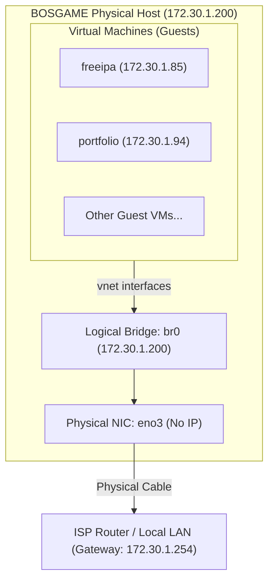

# Hypervisor & Bridge Networking

This section describes the host operating system installation, the physical network bridge configuration, KVM storage layout, and the static DHCP reservation design for Homelab Version 2.

---

## Physical Host System Baseline

*   **Hardware Platform**: Headless BOSGAME P3 Lite Mini PC (AMD Ryzen 7 6800H / 32GB DDR5 RAM / 1TB NVMe SSD).
*   **Operating System**: AlmaLinux 10 (Red Hat Enterprise Linux 10 downstream compatible).
*   **Storage Configuration**: Logical Volume Manager (LVM) partition layout configured during OS install:
    *   `/` (Root): 100GB XFS filesystem for the base OS.
    *   `/var/lib/libvirt/images/vm_pool`: Remaining disk space (~850GB) dedicated to guest virtual machine volumes, backed by an optimized LVM thin pool.

---

## Bridged Network Topology (`br0`)

To allow virtual machines to act as first-class citizens on the physical network (receiving IP addresses from the home router, responding to ping requests, and broadcasting locally), I binded the host's physical Ethernet card to a software bridge (`br0`).


---

## Physical/Host Bridge Setup (nmcli)

While hypervisor services are automated via Ansible, the initial physical interface bridge is configured on the host command-line to ensure persistent ssh connectivity:

### Create the Bridge Interface

```bash
sudo nmcli con add type bridge con-name br0 ifname br0
```

### Configure Static IP Parameters

The command is broken down for readability:

```bash
sudo nmcli con mod br0 ipv4.addresses "172.30.1.200/24"
sudo nmcli con mod br0 ipv4.gateway "172.30.1.254"
sudo nmcli con mod br0 ipv4.dns "172.30.1.85, 1.1.1.1"
sudo nmcli con mod br0 ipv4.method "manual"
sudo nmcli con mod br0 bridge.stp no
```

### Bind the Physical NIC(e.g. `eno3`) to the Bridge

```bash
sudo nmcli con add type bridge-slave con-name br0-slave ifname eno3 master br0
sudo nmcli con up br0
sudo nmcli con delete eno3
```

---

## Automated KVM & Hypervisor Installation

I used Ansible to automate package provisioning, user permission assignments, and system service lifecycle control.

### Host Utility Preparation(`01_host_prep.yml`)

Configures time zone synchronization and installs standard diagnostic/filesystem utilities:

*   Enables the **EPEL** package repository
*   Installs dependencies: `htop`, `tmux`, `git`, `curl`, `rsync`, and `fuse3`(critical for subsequent storage mounts).
*   Enforces host timezone tracking using `timedatectl`.

### Virtualization & Cockpit Orchestration (`02_kvm_setup.yml`)

Deploys hypervisor capability and enables GUI system dashboard tools:

*   Installs the hypervisor stack: `qemu-kvm`, `libvirt`, `virt-install`.
*   Installs **Cockpit** and **cockpit-machines** to expose VM lifecycle metrics through the Cockpit Web Console.
*   Ensures VM administration permissions by adding the administrative user to the `libvirt` group.
*   Enables and starts systemd services: `libvirtd` and `cockpit.socket`.

## MAC Address Reservation Table

To guarantee each VM gets a Consistent IP address from the physical router's DHCP server, MAC addresses are hardocded in the Terraform domain definitions and mapped to DHCP reservations inside the local router interface:

| VM Name | Operating System | MAC Address | Static IP Address | Primary Role |
| :--- | :--- | :--- | :--- | :--- |
| **freeipa** | AlmaLinux 10 | `52:54:00:ee:ef:61` | `172.30.1.85` | Directory Services / BIND DNS |
| **portfolio** | Debian 12 | `52:54:00:ee:ef:62` | `172.30.1.93` | Web Server (NGINX/Portal/Hamster) |
| **minecraft** | Debian 12 | `52:54:00:ee:ef:63` | `172.30.1.91` | Dedicated Game Server |
| **palworld** | Ubuntu 24.04 | `52:54:00:ee:ef:64` | `172.30.1.90` | Dedicated Game Server |
| **navidrome** | Debian 12 | `52:54:00:ee:ef:65` | `172.30.1.92` | Music Streamer + Rclone Mount |
